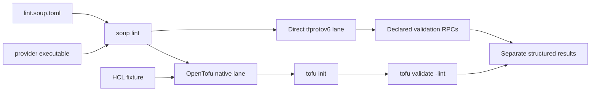

# Provider lint suites

## Purpose

`soup lint` makes provider lint coverage reproducible without claiming that OpenTofu has already standardised provider-defined linting. A provider author checks in a lint suite alongside the provider and runs one public command against a built provider binary.

The command has two deliberately separate lanes:

1. **Direct provider validation** launches the provider through the tfprotov6 protocol and invokes each validation RPC declared in the suite. This can cover provider, resource, data source, ephemeral resource, list, action, and state-store validation.
1. **OpenTofu native linting** creates an isolated provider installation, runs `tofu init -backend=false`, and runs `tofu validate -json -lint=...` for the suite's ordinary HCL fixture.

The lanes share the same provider artifact and optional provider-process environment, but their findings and coverage are rendered independently. A successful direct run never implies that OpenTofu reached the same hooks.

## Public interface

```console
$ soup lint tests/lint/lint.soup.toml \\
    --provider ./dist/terraform-provider-example \\
    --opentofu tofu \\
    --lane all
```

`--provider` selects the executable under test. `--lane all` is the default, so a suite with an OpenTofu fixture requires `--opentofu`; to omit `--opentofu`, select `--lane direct`. The OpenTofu executable may be an explicit path or a command available on `PATH`, and is resolved before execution moves into the isolated fixture. The command returns non-zero for malformed suites, process/protocol failures, error diagnostics, or failed expected-findings checks. Warning diagnostics are successful lint findings unless the suite's expectations say otherwise.

## Suite model

The versioned TOML suite describes only portable provider-test data:

- provider source address, provider version, and optional environment variables;
- zero or more typed direct validation cases, each with a component kind, optional type name, configuration, and expected diagnostic identity;
- an optional native OpenTofu fixture directory and lint selector.

TofuSoup gets each provider schema before encoding a direct case. It rejects unknown kinds, invalid type-name combinations, and invalid configurations before calling the provider. The suite never embeds a provider-specific protocol implementation. Provider-specific settings, such as a transitional environment selector, remain explicit data in the provider's suite.

## Native OpenTofu isolation

The native lane builds a temporary filesystem mirror using the suite's provider version and `TF_CLI_CONFIG_FILE` for the provider source address. It uses a separate `TF_DATA_DIR`, preserves the caller environment except for its controlled Terraform/OpenTofu variables, and reports the exact `init` and `validate` failures without printing secret environment values.

OpenTofu's current linting beta provides core lint selection; it does not define a provider-lint selection protocol. Therefore TofuSoup reports the native lane as OpenTofu coverage and does not label provider warnings as an upstream-native provider lint interface.

## Result model

Human output has one heading per lane and names each exercised component. JSON output contains a stable `direct` and `opentofu` result object, including invoked validation kinds and diagnostics. This allows CI proof tooling to verify a recording without parsing terminal escape sequences.

## Test and proof contract

The feature is developed test-first. The test layers are:

1. Suite parsing and validation tests.
1. Direct-dispatch tests using a fake tfprotov6 provider, including every validation kind and error paths.
1. Native-runner tests using a fake `tofu` executable to assert isolated installation, `init`, and `validate -lint` invocation.
1. A real packaged Pyvider end-to-end suite: all seven direct validation hooks and the OpenTofu-reachable fixture are verified independently.
1. Documentation, CLI-help, and diagram contract tests.

Proof recordings are likewise split: one recording for the direct lane and a separate recording for the OpenTofu lane. Both use only published commands and checked-in fixtures that a provider author can run.

## Architecture


